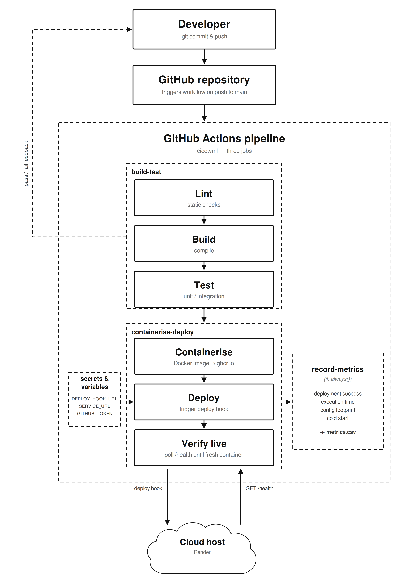

# Lightweight CI/CD pipeline — proof of concept

A lightweight, open-source CI/CD pipeline for small containerised JavaScript/TypeScript
projects, built with GitHub Actions and Docker, deploying to a single cloud host (Render).

This is the primary artefact for the HCS522 project "Design and Implementation of a Lightweight DevOps Pipeline for Small Projects".

Test 10

## What the pipeline does

On every push to `main`, GitHub Actions runs three jobs:

1. **build-test** — install dependencies, then lint, build (for TypeScript projects)
   and test with the native Node test runner.
2. **containerise-deploy** — build a Docker image, push it to the GitHub Container
   Registry (ghcr.io), trigger a deployment to Render via a deploy hook, then wait
   until the new version is actually serving traffic.
3. **record-metrics** — always runs, even when an earlier job fails, and writes the
   run's metrics into a CSV artefact.

Because the metrics job runs with `if: always()`, a failed run is recorded too, so the
deployment success rate reflects failures rather than only the runs that reached
deployment.

### Why the pipeline waits for the deployment

A deploy hook returns HTTP 200 as soon as the deployment is *queued*; the host builds
the image afterwards, and the previous version keeps answering during that window.
Treating the 200 as success would record a successful deployment for a build that later
failed, putting false positives into the primary reliability metric.

So `/health` reports the container's uptime, and the pipeline polls it until a process
that started *after* the deploy was triggered answers. This makes `deployment_success`
mean "the new version reached production", and `execution_time_seconds` a genuine
commit-to-live lead time rather than a commit-to-triggered one. The check relies only on
the application's own `/health`, not on any host-specific variable, so it works on any
deployment target.

Deployments are driven solely by the pipeline: Render's own Auto-Deploy is turned off
(see setup below). Otherwise the host would deploy straight from a git push, in parallel
with the pipeline and regardless of whether the tests passed — which would make the
recorded success rate describe a quality gate that does not exist.

## The four metrics

The evaluation is built around four metrics (see the dissertation, section 3.4):

- **Deployment success rate** — the primary reliability indicator.
- **Execution time** — pipeline duration, with cold-start runs separated from warm runs.
- **Configuration footprint** — the files and lines a developer must add or change to
  adopt the pipeline. This is a limited proxy for adoption cost, not a direct measure
  of usability. Counted automatically from `.github/workflows/cicd.yml`, the
  `Dockerfile` and `.dockerignore`, so the figure is reproducible rather than
  hand-tallied. `eslint.config.js` is excluded: the lint step runs with `--if-present`,
  so a project can adopt the pipeline without it. Raw line counts are used, comments
  included.
- **Recovery time** — the time for the pipeline to return to a successful deployment
  after a failure.

## Planned, controlled fault scenarios

Recovery time cannot be observed unless failures occur. A dependable pipeline may run
many times without failing, so the workflow supports planned, controlled fault
scenarios. Run the workflow manually (the "Run workflow" button, `workflow_dispatch`)
and choose a `fault_scenario`:

- `failing_test` — forces the test step to fail.
- `broken_build` — forces the build step to fail.
- `bad_deploy_credential` — uses an invalid deploy hook so deployment fails.
- `none` — a normal run (the default).

Each injected failure is recorded in the metrics artefact under `fault_scenario`, so
recovery runs can be told apart from the natural runs.

## Repository layout

```
.
├── .github/workflows/cicd.yml          # the pipeline (build-test, containerise-deploy, record-metrics)
├── src/server.js                       # baseline app (App 1)
├── test/server.test.js                 # tests
├── Dockerfile                          # multi-stage build
├── package.json
├── eslint.config.js
└── docs/
    ├── pipeline_architecture.svg       # architecture diagram (source, vector)
    ├── pipeline_architecture.png       # architecture diagram (2600×3800, for the write-up)
    ├── security_baseline.md            # security checklist (Objective 1)
    ├── benchmark_dataset_template.csv  # dataset template (Objective 3)
    └── evaluate.py                     # evaluation script (Objective 4)
```

## Architecture



## Setup — step by step

### 1. Create the repository
Push this folder to a new GitHub repository.

### 2. Create a Render service
1. Sign up at render.com (no credit card required for the free tier).
2. New → Web Service → connect your GitHub repository.
3. Render auto-detects the Dockerfile. Set the instance type to Free.
4. Leave **Root Directory** empty — the Dockerfile is at the repository root.
5. Leave **Environment Variables** empty. Render injects `PORT` itself, and the app
   reads it; `NODE_ENV` is already set in the Dockerfile.
6. Under Advanced, set **Auto-Deploy** to **Off**, so the pipeline is the only thing
   that can deploy (see "Why the pipeline waits for the deployment" above).
7. Under Advanced, set **Health Check Path** to `/health`.
8. Once created, go to Settings → Deploy Hook and copy the hook URL.

### 3. Add the deploy hook as a GitHub secret
In your GitHub repo: Settings → Secrets and variables → Actions → New repository secret.
- Name: `RENDER_DEPLOY_HOOK_URL`
- Value: the deploy hook URL from Render → Settings → Build & Deploy → Deploy Hook.

This is **not** the service's public URL. A deploy hook looks like
`https://api.render.com/deploy/srv-XXXX?key=YYYY` — note the `api.render.com` host and
the `key` parameter. Pasting the service URL here is an easy mistake to make, because
the two are configured on adjacent tabs of the same settings page, and it fails in a
confusing way: the service answers 200 to any request, so the pipeline reads a success
and then waits out its whole verification timeout for a deployment that was never
requested. The workflow now guards against exactly this by requiring the hook's response
to carry a deploy id, and says so when it does not.

Treat the hook URL as a credential: anyone holding it can trigger deployments. If it
leaks, regenerate it from the same Render settings page.

Deploy hooks work with Auto-Deploy set to Off — Off disables the host's own git
trigger, not the hook.

### 4. Add the service URL as a GitHub variable
Same page, the **Variables** tab → New repository variable. The service URL is public
information, so it is a variable rather than a secret; only the deploy hook grants any
capability.
- Name: `RENDER_SERVICE_URL`
- Value: the service's URL, with no trailing slash (e.g. `https://your-app.onrender.com`).

Without it the pipeline still deploys, but it cannot confirm the new version went live
or record a cold start: the run is then marked `live unverified` in the metrics notes.

### 5. Trigger the pipeline
Push any commit to `main`, or use the "Run workflow" button (`workflow_dispatch`).
Watch the run under the Actions tab.

### 6. Collect metrics
After each run, download the `metrics-<run_id>` artefact from the Actions run page. Its
columns are exactly those of `docs/benchmark_dataset_template.csv`, in the same order,
so the row can be appended to the dataset unchanged.

Two columns are left blank on purpose. `recovery_time_seconds` spans two runs — the
failure and the next success — so no single run can compute it; fill it in from the
controlled fault scenarios. `execution_time_seconds` is blank when `build-test` never
started, because a zero there would be a fabricated measurement that would drag the
timing averages down.

### 7. Evaluate
Once the dataset has recorded runs, produce the summary:

```
python3 docs/evaluate.py docs/benchmark_dataset_template.csv
```

## Running the test applications

For Objective 3, run the pipeline at least ten times against three applications:
- the baseline app in this repo,
- two external open-source JavaScript/TypeScript apps (verify each builds in week 2).

For each external app, copy `.github/workflows/cicd.yml`, the `Dockerfile`, and adjust
the `start`/`test` scripts to match that project. Set `APPLICATION_NAME` at the top of
the workflow to that application's name (`opensource-app-1`, `opensource-app-2`) so its
rows land in the right group when `evaluate.py` aggregates the dataset. The
configuration footprint is then counted automatically for that repository.

The post-deploy verification expects the application to expose a `/health` endpoint
returning `uptimeSeconds`, as `src/server.js` does. An application without it still
deploys, but leave `RENDER_SERVICE_URL` unset for that repository so the run is recorded
as `live unverified` rather than timing out.

## Local development

```
npm install
npm test
npm start      # serves on http://localhost:3000
```

## References and documentation

This proof of concept is built on the following tools. Their official documentation is
the primary reference for how the pipeline is configured and how it can be adapted.

- GitHub Actions — workflow syntax, jobs, permissions and secrets: https://docs.github.com/en/actions
- Docker — Dockerfile reference, multi-stage builds and best practices: https://docs.docker.com
- GitHub Container Registry (ghcr.io) — publishing and consuming images: https://docs.github.com/en/packages
- Render — deploying a service and using deploy hooks: https://render.com/docs

## License

MIT.
